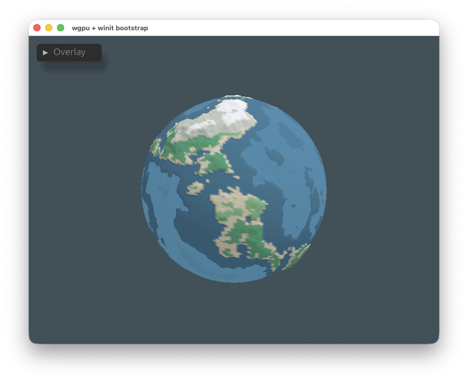
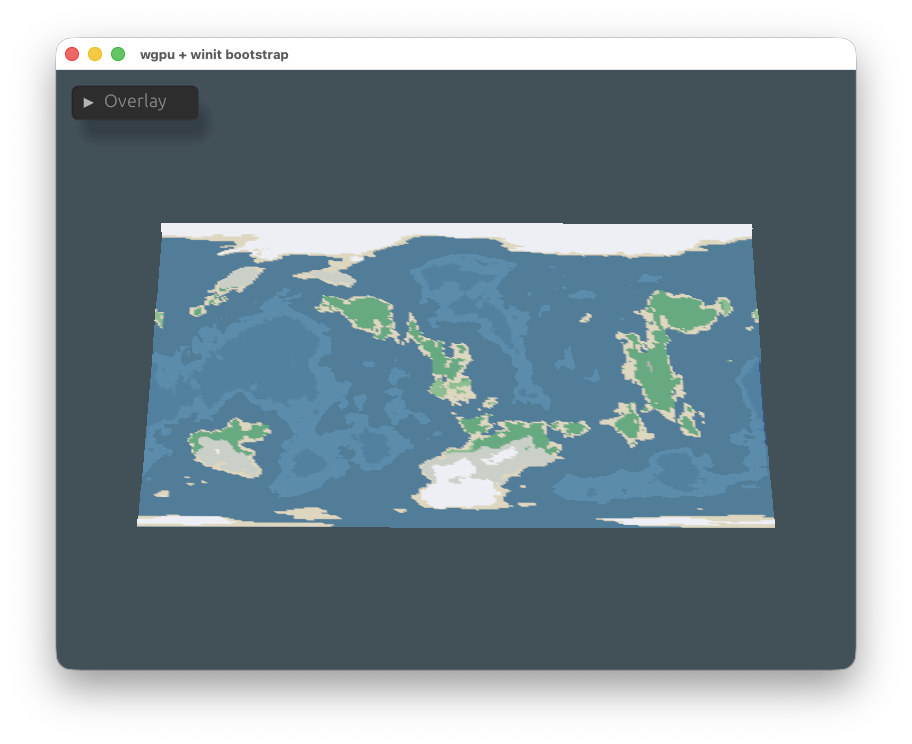
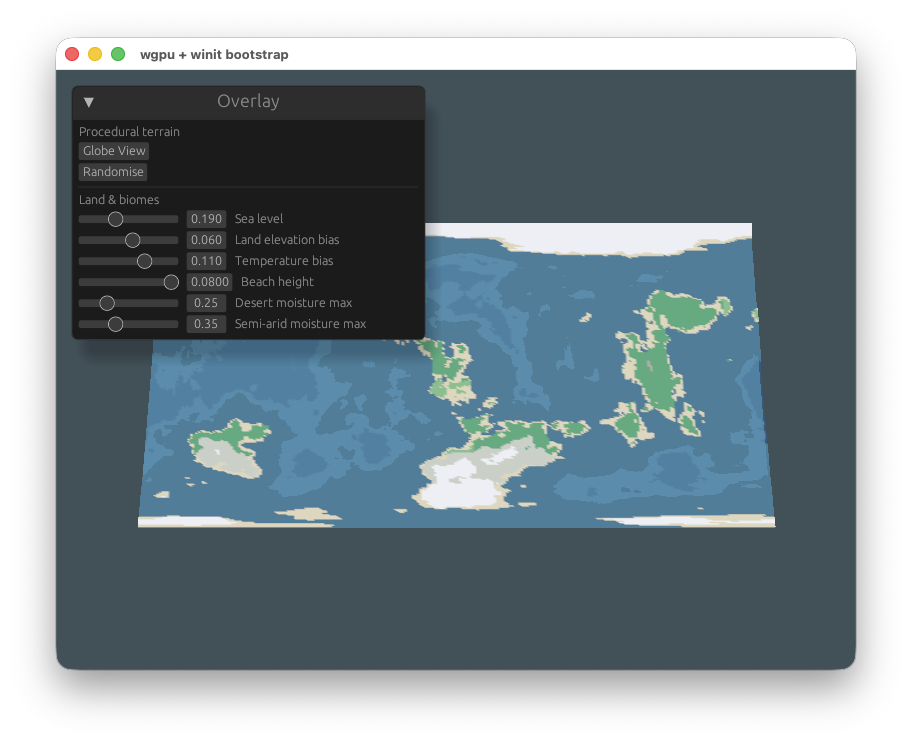

# nskog-3d-terrain-editor

A procedural globe terrain editor with a globe-to-map transition, orbit camera, and live biome tuning.

## Screenshots

### 1

### 2

### 3

In order to run the project:
# cargo run
or with UI features enabled:
# cargo run --features ui